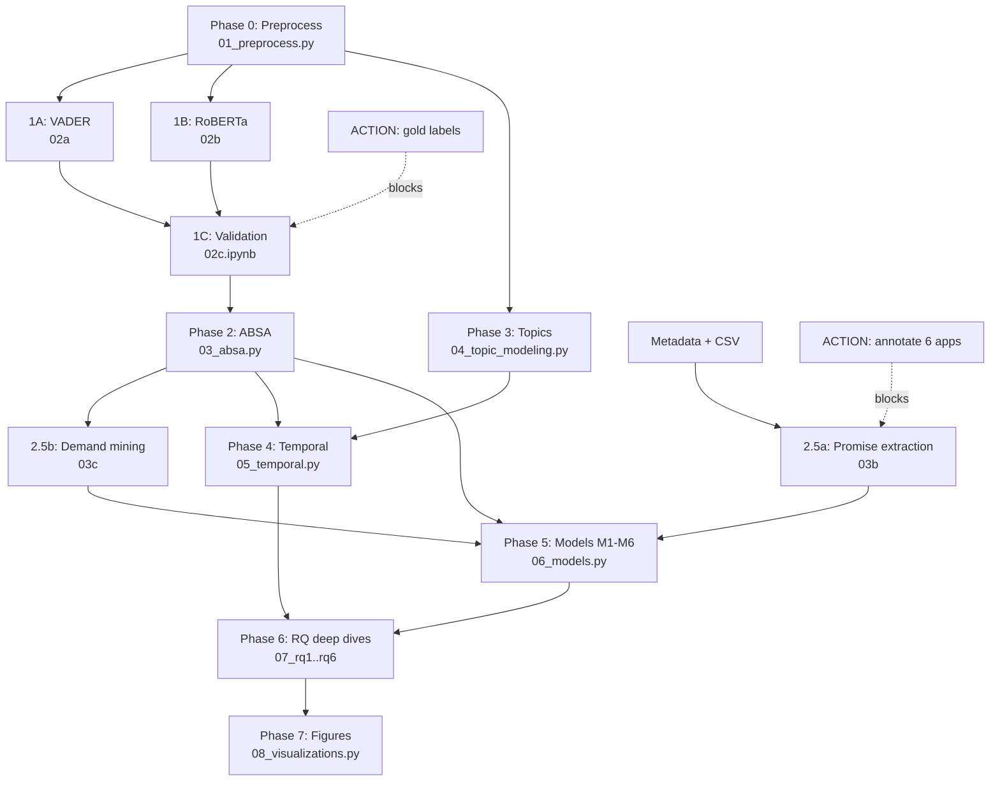

# Sentiment Analysis Implementation Plan — Salah App User Reviews (v2)

**Dataset**: 732,194 Google Play reviews across 26 Salah/prayer apps, scraped 2026-08-19 (`Sort.NEWEST`, `lang=en`, `country=us`)
**Temporal coverage**: 2011-04 → 2026-08 (verified on the four largest apps)
**Feature matrix**: `Salah App Analysis - Sheet1.csv` — 22 feature columns × 26 apps (**20 annotated, 6 empty**)
**Purpose**: Multi-method sentiment + thematic analysis supporting a 6-RQ paper on the Salah app ecosystem, with design implications for Falah

> [!NOTE]
> **v2 changes**: RQs revised per author direction; old RQ6 merged into new RQ6 as sub-question 6a; unit of analysis moved from app to review; aspect taxonomy re-aligned 1:1 with CSV feature columns; two new modules added (promise extraction, demand mining); new Phase 5 for statistical modelling. v1 is preserved in git history.

---

## 1. Research Questions (revised)

| RQ | Question | Independent variable | Primary outcome | Unit | Power |
|----|----------|---------------------|-----------------|------|-------|
| **RQ1** | **The Gamification Tension** — do users love or hate prayer streaks and grading scores? | `Prayer Tracker` (10/20), `Tracker Analysis / Score` (7/20), `Goal System` (2/20) | Sentiment + affect valence (guilt/anxiety vs. motivation) on tracker-aspect reviews | Review | **Strong** |
| **RQ2** | **Algorithmic Accuracy vs. Pretty UI** — do calculation errors and bad compasses actually hurt ratings, or do users just want a nice interface? | Complaint type present in review (accuracy / qibla / madhab / calc-method vs. UI / design) | Star rating of that review (competing predictors) | Review | **Strong** |
| **RQ3** | **The Muslim Traveler Advantage** — does offering rare features like auto-shortening prayers give a competitive edge? | `Auto Qasr mode` (**1**/20), `Mosque Finder` (8/20) | Preference-citation rate + unmet-demand rate | Review + app | **Split**: mosque finder testable; qasr = demand evidence only |
| **RQ4** | **Bio-Spiritual Inclusion (FemTech)** — do apps accounting for menstrual exemptions get higher ratings and user loyalty? | `Women tracking` (**3**/20) | Loyalty proxies + women-aspect sentiment + unmet demand | Review + app | **Weak between-app**; strong as demand/valence analysis |
| **RQ5** | **Feature Bloat vs. Companion Hardware** — do all-in-one apps with smart rings beat simple clean apps, or does bloat ruin them? | Total feature count (0–22 continuous), `Widgets` (12/20), `Has Companion Hardware` (**1**/20) | Complexity/bug complaint rate, sentiment | Review (app-clustered) | **Moderate** for bloat; hardware = case study |
| **RQ6** | **Full-Fledged Spiritual Companion** — are current apps enough to meet all Salah-related needs? *(6a delivery gap · 6b coverage gap)* | All 22 features × promise sources | 6a: negative-sentiment rate where feature is claimed · 6b: demand volume where feature is absent | Feature × app | **Strong** (synthesis) |

### 1.1 Why the old RQ6 became RQ6a

The v1 RQ6 ("Do apps deliver what they preach?") is not a separate question from the new RQ6 — it is its **necessary first half**:

```
RQ6: Are current apps enough?
 ├─ RQ6a  DELIVERY GAP   feature claimed (✓) → do users complain about it?      "it exists but it's broken"
 └─ RQ6b  COVERAGE GAP   feature absent  (✗) → do users request it?             "it doesn't exist at all"
```

Both halves consume the same artefact (feature matrix ⋈ aspect-level sentiment), and "enough" is meaningless if you only count features without checking whether they work. Keeping them as separate RQ6 and RQ7 would duplicate the analysis and push the paper to seven RQs. RQ6 is now the **synthesis RQ** — it consumes the outputs of RQ1–RQ5 and feeds directly into the Falah design-implications section.

---

## 2. Feasibility Audit

Everything below was verified against the actual files, not assumed. These three findings reshape the method.

### 2.1 Rare-feature problem — the headline constraint

Feature prevalence across the 20 annotated apps:

| Feature | n/20 | Feature | n/20 |
|---|---|---|---|
| Prayer Times by Location | 20 | Prayer times in Table format | 11 |
| Timely Reminders | 20 | Custom Reminder Sounds | 10 |
| All Features for free | 19 | Prayer Tracker | 10 |
| Qibla Compass | 18 | Forbidden Times | 8 |
| Madhab Variations | 12 | Mosque Finder | 8 |
| Widgets | 12 | Tracker Analysis / Score | 7 |
| Various methods of calculation | 11 | Nafl Prayer Times | 6 |
| Waqt relative reminders | 11 | Useful Adhkars | 6 |
| | | Salah and/or Wudu Guides | 4 |
| | | **Women tracking** | **3** |
| | | Goal System and Other events | 2 |
| | | **Auto Qasr mode** | **1** |
| | | Connect to Google Calendar | 1 |
| | | **Has Companion Hardware** | **1** |

Three of the revised RQs name a feature held by ≤3 apps. Compounding this, app-level star ratings are **ceiling-compressed** — sampled app means are 4.44 (Muslim Pro), 4.66 (Athan), 4.70 (Salatuk), 4.89 (Muslim Bangla) on a bounded 1–5 scale — so between-app rating differences are small, noisy, and overwhelmingly driven by confounds (install base, ad load, language market, app age 2011–2025) rather than by any single feature.

> [!WARNING]
> **Do not run app-level regressions of star rating on feature presence as the primary analysis.** With N=20 units, one treated app, and a compressed DV, the result is uninterpretable regardless of the p-value. Any reviewer at a CHI-tier venue will reject it.

**Design correction — three moves:**

1. **Move the unit of analysis to the review.** ~732K observations instead of 20. Feature presence enters as an app-level covariate in a mixed-effects model with a random intercept per app, which handles clustering honestly and reports between-app effects with correct (wide) uncertainty.
2. **Reframe rare features from causal claim to demand evidence.** For `Auto Qasr`, `Companion Hardware`, `Women tracking`: instead of "does having it raise ratings" (untestable), ask **"how many users of the 17–19 apps *without* it ask for it, and how do the users of the app(s) *with* it talk about it?"** This is well-powered, novel, and is exactly what RQ6b needs anyway.
3. **Report the rare-feature app as a named case study**, not an anonymous treatment cell — iQIBLA Life (Zikr Ring) for RQ5, Muslim Bangla (Auto Qasr) for RQ3.

### 2.2 Annotation gap — 6 apps, 133,347 reviews (18.2%) unannotated

| Unannotated app | Reviews | Downloads |
|---|---|---|
| Salatuk (Prayer time) | 111,232 | 50M+ |
| Salaat First: Prayer Times | 8,895 | 10M+ |
| নামাজের সময়সূচি - Prayer Time | 6,572 | 1M+ |
| Prayer Times and Qibla | 4,546 | 1M+ |
| Sadiq: Prayer, Quran, Qibla | 1,525 | 100K+ |
| IslamApp: Prayer times & Athan | 577 | 1M+ |
| **Total** | **133,347** | |

Every feature-matrix join silently drops these, taking the second-largest app in the corpus with it, and `Total Feature Count` (RQ5's core IV) is undefined for them.

**Mitigation — dual promise source.** All 26 apps have substantive Play Store descriptions (median 2,635 chars; range 877–4,056) plus `adSupported`, `offersIAP`, and `released` in `metadata.json`. Phase 2.5 extracts claimed features from the store description for all 26 apps. This:
- covers the 6 unannotated apps for every RQ,
- gives an **independent second measurement** of the same construct — inter-source agreement (Cohen's κ against the 20 hand-annotated apps) becomes a reportable validity check,
- is arguably the *better* operationalization of RQ6a: the store description is literally what the app **preaches** to a prospective user.

The manual CSV stays the primary IV for the 20 annotated apps (it reflects hands-on verification); the description-derived matrix is the fallback and the robustness check.

### 2.3 Corpus composition — half the reviews carry no aspect content

| App | n | % under 5 words | % non-ASCII | Dev reply rate |
|---|---|---|---|---|
| Muslim Pro | 283,371 | 52% | 8% | 16.7% |
| Salatuk | 111,232 | 63% | 30% | 1.1% |
| Athan | 90,003 | 50% | 12% | 3.6% |
| Muslim Bangla | 53,332 | 61% | 40% | 78.8% |

Roughly **half to two-thirds of the corpus is under five words** ("Good", "Nice app", "Alhamdulillah"). These carry a star rating but essentially no aspect signal — they will inflate the "neutral" class, dominate topic models with degenerate clusters, and dilute every aspect denominator if left in.

**Correction**: define explicit analysis sub-corpora (§3.3) rather than v1's "flag but keep" approach. Short reviews are retained for rating/volume/temporal analyses and excluded from ABSA and topic modelling.

Developer reply rate varies from 1.1% to 78.8% — unusually good variance for the response analysis in Phase 5.

### 2.4 Sampling caveats to state in the paper

- `Sort.NEWEST` with `reviews_all` — recency-weighted, not a uniform sample of all-time reviews.
- Text reviews only; the ~1.9M ratings-without-text for Muslim Pro are invisible here. The corpus describes **users who chose to write**, not all users.
- `lang=en, country=us` sets the storefront, **not** the review language — Bengali, Arabic, and Urdu reviews are present throughout (up to 40% non-ASCII).

---

## 3. Phase 0 — Preprocessing

### 3.1 Merge & normalize
- Concatenate 26 `reviews/*/reviews.csv` → one frame with `app_name`, `package`, and app-level metadata joined from `metadata.json` (`realInstalls`, `score`, `ratings`, `released`, `adSupported`, `offersIAP`, `genre`).
- Deduplicate on `reviewId`.
- Text normalization: preserve raw `content`; add `content_clean` (URLs/emails stripped, whitespace collapsed, casing preserved for the transformer, lowercased copy for lexicon methods). **Extract emoji to a separate `emoji` column before stripping** — they are sentiment-bearing and disproportionately present in the short reviews.
- Parse `at` and `repliedAt` → datetime; derive `year`, `quarter`, `month`, `days_to_reply`, `app_age_at_review` (review date − `released`).
- Derive `n_words`, `n_chars`, `has_reply`, `thumbsUpCount`.

### 3.2 Language detection
- `fasttext` lid.176 (preferred over `langdetect` — far more reliable on short informal text, and half this corpus is short).
- Store `lang` + `lang_conf`. Report the language × app distribution as a descriptive table.
- Translate non-English reviews **in the analysis sub-corpus only** (`n_words ≥ 5`) via `deep-translator`, storing `content_en` and `translated=True`. Translating 300K+ short strings is neither affordable nor useful.

### 3.3 Analysis sub-corpora

| Corpus | Definition | Used for |
|---|---|---|
| `C_all` | all 732,194 | volume, rating distributions, temporal trends, developer response |
| `C_text` | `n_words ≥ 5` and non-empty | **sentiment + ABSA + topic modelling (primary)** |
| `C_en` | `C_text` ∧ `lang == en` | primary modelling corpus |
| `C_trans` | `C_text` ∧ `lang != en`, machine-translated | reported separately, never pooled into headline numbers |
| `C_annot` | `C_text` ∧ app in the 20 annotated | feature-matrix joins (CSV-primary path) |

> [!IMPORTANT]
> **Deliverable**: `scripts/01_preprocess.py` → `data/master_reviews.parquet` (all, with `corpus_*` boolean flags rather than four physical files — simpler joins, one source of truth).

---

## 4. Phase 1 — Sentiment Classification

Unchanged from v1 in method; changed in scope (runs on `C_text`, not everything).

### 4.1 Method A — VADER
NLTK VADER on `content_clean`; `compound ≥ 0.05` → Positive, `≤ −0.05` → Negative, else Neutral. Fast, interpretable baseline.

### 4.2 Method B — CardiffNLP RoBERTa
`cardiffnlp/twitter-roberta-base-sentiment-latest`, batched GPU inference (RTX 5090, fp16, dynamic padding, batch 256). ~300K `C_text` reviews ≈ 15–25 min. Store all three class probabilities, not just argmax — the probability mass is needed for aspect-weighted aggregation in Phase 2.

### 4.3 Method C — star-rating proxy
1–2★ → Negative, 3★ → Neutral, 4–5★ → Positive. Weak ground truth only. **Known limitation, now central**: the star is an app-level verdict, so a 5★ review containing "only complaint is the qibla is off" is mislabelled at the aspect level — this is precisely the divergence RQ2 exploits, so it must be measured, not assumed away.

### 4.4 Cross-method validation
- Cohen's κ for all three pairs; confusion matrices.
- **Gold set: 500 reviews**, stratified by install tier (>100M / 10M–100M / 1M–10M / <1M) × star (1–2 / 3 / 4–5) × language (en / translated), labelled {Positive, Negative, Neutral, Mixed}. Precision/recall/F1 per method. Krippendorff's α if ≥2 annotators (recommended: 2 annotators on a 100-review overlap, then split the remainder).
- **Add a second gold set of 300 reviews labelled for aspect + per-aspect sentiment** — Phase 2 is the paper's analytical core and cannot be validated by a document-level gold set.

> [!IMPORTANT]
> **Deliverables**: `scripts/02a_sentiment_vader.py`, `scripts/02b_sentiment_roberta.py`, `notebooks/02c_cross_validation.ipynb`, `data/master_reviews_with_sentiment.parquet`, `data/gold_labels/`

---

## 5. Phase 2 — Aspect-Based Sentiment Analysis

**Change from v1**: the taxonomy is re-aligned 1:1 with the CSV feature columns. v1's 14 ad-hoc aspects could not be joined to the feature matrix, which would have broken RQ6 entirely. Twenty aspects now map to a named CSV column; seven are review-only (no CSV column but essential to the RQs).

### 5.1 Aspect taxonomy — CSV-linked

| Aspect | ← CSV column | Seed keywords | RQ |
|---|---|---|---|
| `prayer_times_accuracy` | Prayer Times by Location | prayer time, wrong time, accurate, inaccurate, fajr, maghrib, isha, minutes off, location | RQ2, RQ6 |
| `madhab` | Madhab Variations | hanafi, shafi, maliki, hanbali, madhab, mazhab, asr time | RQ2 |
| `calc_method` | Various methods of calculation | calculation method, isna, mwl, umm al-qura, karachi, egyptian, angle | RQ2 |
| `reminders_adhan` | Timely Reminders + Waqt relative + Custom Sounds | azan, adhan, athan, notification, alarm, reminder, sound, silent, doesn't ring, late | RQ2, RQ6 |
| `forbidden_times` | Forbidden Times | forbidden, makruh, sunrise, zawal, sunset, haram time | RQ6b |
| `nafl_times` | Nafl Prayer Times | tahajjud, ishraq, duha, chasht, nafl, sunnah prayer | RQ6b |
| `goal_system` | Goal System and Other events | goal, challenge, target, event, badge, reward | RQ1 |
| `mosque_finder` | Mosque Finder | mosque, masjid, nearby, jamaat, congregation, iqamah | RQ3 |
| `guides` | Salah and/or Wudu Guides | how to pray, wudu, ablution, guide, learn salah, step by step | RQ6 |
| `adhkar` | Useful Adhkars | dhikr, zikr, adhkar, tasbih, dua, morning evening | RQ6 |
| `qibla` | Qibla Compass | qibla, compass, direction, kaaba, mecca, calibrat, pointing wrong | RQ2 |
| `table_format` | Prayer times in Table format | table, monthly, calendar view, timetable, schedule, pdf | RQ6b |
| `qasr_travel` | Auto Qasr mode | qasr, travel, shorten, journey, musafir, abroad, flight, timezone | RQ3 |
| `calendar_sync` | Connect to Google Calendar | google calendar, sync, calendar event | RQ6b |
| `monetization` | All Features for free | premium, subscription, paid, free, paywall, purchase, expensive | RQ5, RQ6 |
| `prayer_tracker` | Prayer Tracker | track, log, record, mark, missed, qada, qaza, habit | RQ1 |
| `tracker_score` | Tracker Analysis / Score | streak, score, grade, percentage, statistics, progress, chart, rank | RQ1 |
| `women_period` | Women tracking | period, menstruation, haid, cycle, women, sister, exemption, exclude | RQ4 |
| `widgets` | Widgets | widget, home screen, lock screen, always on | RQ5 |
| `companion_hardware` | Has Companion Hardware | ring, watch, smartwatch, wearable, device, band, pair, bluetooth | RQ5 |

### 5.2 Aspect taxonomy — review-only (no CSV column)

| Aspect | Seed keywords | RQ |
|---|---|---|
| `ui_design` | interface, design, ui, layout, beautiful, clean, ugly, theme, dark mode, easy to use | **RQ2** |
| `stability_bugs` | crash, bug, freeze, force close, slow, lag, battery, not working | RQ2, RQ5 |
| `ads_intrusive` | ads, advertisement, popup, full screen ad, too many ads | RQ5, RQ6 |
| `privacy_data` | privacy, data, permission, tracking, spyware, sold my data, location access | RQ4 |
| `quran_audio` | quran, surah, ayah, recitation, tafsir, translation, audio | RQ6 |
| `complexity_bloat` | too many features, cluttered, complicated, confusing, bloated, heavy, simple, minimal | **RQ5** |
| `spiritual_affect` | guilt, guilty, anxious, pressure, ashamed, motivat, encourag, barakah, closer to allah, discipline | **RQ1** |

`complexity_bloat` and `spiritual_affect` are the two aspects the revised RQs *require* and v1 lacked — RQ5's bloat construct and RQ1's love/hate tension are otherwise unmeasurable.

### 5.3 Extraction pipeline

1. **Sentence segmentation** — split each review into sentences (`pysbd`, robust to informal text). Aspect assignment and sentiment happen **at sentence level**, which is what makes "5★ but the qibla is broken" recoverable.
2. **Lexicon tagging** — expanded keyword/regex sets per aspect, including transliterations (azan/athan/adhan, zikr/dhikr, mazhab/madhab, qaza/qada) and Bengali/Arabic surface forms for the untranslated path. A sentence may carry multiple aspects.
3. **Zero-shot backstop** — `facebook/bart-large-mnli` over aspect labels, run **only on sentences with no lexicon hit** in `C_text` (keeps cost bounded). Accept above a tuned threshold calibrated on the 300-review aspect gold set.
4. **Per-aspect sentiment** — RoBERTa on the triggering sentence(s); aggregate to review×aspect by probability-weighted mean.
5. **Negation and request handling** — a sentence matching a request pattern ("wish it had a qibla") must **not** be scored as negative sentiment toward an existing qibla feature; route it to Phase 2.5 demand mining instead. This is a common and paper-killing failure mode in keyword ABSA.

### 5.4 Output
`data/aspect_sentiments.parquet` — long format, one row per `(reviewId, aspect)`: sentiment label, probabilities, triggering sentence, match method (lexicon / zero-shot), `is_request` flag.

> [!IMPORTANT]
> **Deliverables**: `scripts/03_absa.py`, `data/aspect_sentiments.parquet`, `data/aspect_lexicon.yaml` (taxonomy externalized so it is reviewable and citable in the paper)

---

## 6. Phase 2.5 — Promise Extraction & Demand Mining *(new)*

The module that makes RQ3, RQ4, RQ5, and RQ6 answerable despite §2.1 and §2.2.

### 6.1 Promise extraction (all 26 apps)
- Segment each `metadata.json` description into feature bullets/sentences.
- Classify each against the same 22-feature taxonomy (lexicon + zero-shot), producing `promised[app, feature] ∈ {0,1}` with the supporting sentence retained as evidence.
- Validate against the 20 hand-annotated apps: Cohen's κ per feature, and a confusion table. Report it — this is a genuine measurement-validity contribution.
- Combine `adSupported` / `offersIAP` with `All Features for free` to check monetization claims.
- Output `data/feature_matrix_combined.parquet`: `app × feature × {csv_annotated, description_claimed, source_agreement}`.

### 6.2 Demand mining
Extract explicit feature requests and unmet needs from review text:
- **Request patterns**: `wish|hope|please add|should have|would be (nice|better|great) if|needs? (a|an|to)|missing|no option|can you add|kindly add|suggestion|lacks`
- **Absence patterns**: `doesn't have|does not support|no <aspect>|couldn't find`
- **Switching / churn patterns**: `uninstall|deleted|switched to|moved to|better than|going back to` → also feeds RQ4 loyalty and RQ3 competitive edge
- **Preference-citation patterns**: `that's why I use|only app that|no other app|the reason I` → the operationalization of "competitive edge"
- Attach each match to an aspect → `data/demand.parquet`: `(reviewId, app, aspect, request_type, evidence_sentence)`
- Precision-check on a 200-request manual sample; report precision, since these patterns are noisy.

**This is what rescues the rare-feature RQs.** "Auto Qasr exists in 1 of 20 apps, and 1,200 reviews across the other 19 apps explicitly ask for travel/qasr handling" is a stronger and more publishable finding than a null between-app rating test.

> [!IMPORTANT]
> **Deliverables**: `scripts/03b_promise_extraction.py`, `scripts/03c_demand_mining.py`, `data/feature_matrix_combined.parquet`, `data/demand.parquet`

---

## 7. Phase 3 — Topic Modelling

- `BERTopic` with `all-MiniLM-L6-v2` (or `paraphrase-multilingual-MiniLM-L12-v2` for a multilingual run over `C_trans`), on `C_en` only for the headline model.
- Guardrails: `min_topic_size` tuned to corpus size, custom `CountVectorizer` with an Islamic-domain stopword list (app names, "allah", "islam", "muslim", "app", "good", "nice" — otherwise these dominate every cluster), `nr_topics="auto"` then manual reduction to 15–25 interpretable themes.
- Run on `C_text` only — with 50–60% of reviews under five words, an unfiltered run produces a giant "good app" cluster and little else.
- Label topics from top-20 representative documents; tag each with RQ(s); compute prevalence per app; topic × sentiment heatmap.
- **Sub-topic models within aspects** for RQ1 (tracker reviews only) and RQ4 (women/privacy reviews only) — the ecosystem-level model will not resolve streak-anxiety vs. streak-motivation on its own.

> [!IMPORTANT]
> **Deliverables**: `scripts/04_topic_modeling.py`, `notebooks/04_topic_exploration.ipynb`, `data/topics.parquet`

---

## 8. Phase 4 — Temporal Analysis

- Monthly/quarterly sentiment and rating aggregates per app; 3-month rolling mean; changepoint detection (`ruptures`, PELT) rather than eyeballing.
- **Muslim Pro 2020 privacy case study** — corpus covers 2011→2026, so a pre/post interrupted time-series around the Nov 2020 data-sale reporting is available; use `privacy_data` aspect volume and sentiment as the outcome.
- Aspect volume over time — e.g. is `ads_intrusive` rising, is `tracker_score` a recent phenomenon? (Directly informs RQ1: gamification is a *recent* design trend; its review footprint should be dated.)
- Version-level sentiment where `appVersion` is populated; flag releases with significant sentiment drops.
- **Confound to control**: recency-weighted sampling (§2.4) means older periods are thinner. Always plot n alongside the trend and avoid claims in sparse early periods.

> [!IMPORTANT]
> **Deliverables**: `scripts/05_temporal.py`, `notebooks/05_temporal_visualizations.ipynb`

---

## 9. Phase 5 — Statistical Modelling *(substantially new)*

v1's Phase 5 was descriptive cross-app aggregation. The revised RQs make explicit comparative claims, so they need explicit models. All models are **review-level with a random intercept per app** (`statsmodels` MixedLM, or `pymer4`/R `lme4` if crossed effects are needed).

### 9.1 M1 — RQ2 core: competing predictors of dissatisfaction

```
score_ij ~ complaint_accuracy + complaint_qibla + complaint_madhab + complaint_calcmethod
         + complaint_ui + complaint_bugs + complaint_ads + complaint_reminders
         + log(n_words) + review_year + (1 | app)
```

Fit as a linear mixed model and, as a robustness check, an ordinal mixed model (star is ordinal, ceiling-heavy). **The paper's answer to RQ2 is the comparison of the accuracy-family coefficients against the `complaint_ui` coefficient** — which class of complaint costs more stars, within the same app, controlling for review length and era. Report standardized effects with CIs, not just p-values.

### 9.2 M2 — RQ1: gamification valence

- Among `prayer_tracker` ∨ `tracker_score` ∨ `goal_system` reviews: sentiment ~ tracker tier (none / tracker only / tracker + score) + `(1 | app)`.
- Affect split: rate of `spiritual_affect`-negative (guilt, pressure, anxiety, shame) vs. `spiritual_affect`-positive (motivation, discipline, consistency) *within* tracker reviews vs. the corpus baseline. **The love/hate tension is the ratio, not the mean sentiment** — a mean can hide a bimodal split, which is precisely the phenomenon RQ1 posits. Report the distribution shape (and a bimodality/dip test), not just central tendency.
- Qualitative coding of 50 tracker-negative reviews for the thematic layer.

### 9.3 M3 — RQ4: inclusion, with honest power

- **Primary (well-powered)**: volume and sentiment of `women_period` reviews across all 26 apps; demand rate for menstrual exemption among apps lacking it; qualitative coding of the full set (this will be a few hundred to a few thousand reviews — report n plainly, and if it is small, *that scarcity is itself the finding*).
- **Secondary (underpowered, labelled as such)**: 3 apps with `Women tracking` vs. 17 without; report as descriptive comparison with bootstrap CIs and an explicit statement that N=3 precludes causal inference. Note the confound directly: `Islamic Habit tracker` is one of the three and carries the lowest CSV rating in the corpus (3.8).
- **Loyalty operationalization** (Play data has no retention; these are proxies and must be labelled as proxies):

| Proxy | Extraction |
|---|---|
| Tenure mentions | regex `using (this|it) for \d+ (years|months)`, `since 20\d\d` |
| Churn signals | `uninstall`, `deleted`, `switched to`, `going back to` |
| Endorsement | `thumbsUpCount` distribution |
| Rating trajectory | per-app rating slope over time |

### 9.4 M4 — RQ5: bloat vs. hardware

- Compute `feature_count` (0–22) per app from `feature_matrix_combined` (description-derived for the 6 unannotated).
- **Review-level**: `P(complexity_bloat complaint)` and `P(stability_bugs complaint)` ~ `feature_count` + `log(realInstalls)` + `adSupported` + `(1 | app)`. Logistic mixed model.
- **App-level** (n=20/26, exploratory only): Spearman ρ of `feature_count` against mean sentiment and against complaint rates, with bootstrap CIs. Explicitly framed as exploratory.
- **Hardware**: iQIBLA Life as a case study — sentiment and theme profile of its `companion_hardware` reviews (n≈? from 4,294 total), plus the demand rate for wearable/watch support across the other 25 apps.
- **Confound to name**: feature count correlates with install base and company size. `log(realInstalls)` is a required control, and residual confounding should be acknowledged rather than modelled away.

### 9.5 M5 — RQ3: competitive edge

- `Mosque Finder` (8/20) is testable: preference-citation rate and `mosque_finder` sentiment, with `(1 | app)`.
- `Auto Qasr` (1/20) is not: report demand volume across the 19 apps lacking it, plus the qasr/travel complaint profile inside those apps (mistimed prayers after travel, timezone bugs) — the *problem* is measurable ecosystem-wide even though the *solution* exists in one app.

### 9.6 M6 — RQ6: the gap matrix

- **6a Delivery gap**: for each `(app, feature)` where promised = 1, compute negative-sentiment rate on the corresponding aspect and mention volume. Flag `neg_rate > 40%` and `n ≥ 30` as a broken promise. Output an app × feature matrix.
- **6b Coverage gap**: for each `(app, feature)` where promised = 0, compute demand rate from `data/demand.parquet`. Aggregate to ecosystem level: **which needs does no app in the corpus serve well?** — the direct answer to "are current apps enough".
- Rank unmet needs by (demand volume × number of apps failing to serve them). This ranked list is the bridge to the Falah design-implications section.

### 9.7 Multiple comparisons & reporting
- α = 0.05 with **Benjamini–Hochberg FDR** rather than Bonferroni — with 22 features × multiple aspects, Bonferroni is so conservative that it guarantees a null result. Report both q-values and effect sizes; make effect sizes with CIs the headline.
- Every rare-feature test carries a stated power caveat in the table caption.

### 9.8 Developer response analysis (retained from v1)
Reply rate per app (verified range 1.1%–78.8%), sentiment of replies, `days_to_reply` distribution, and whether reply presence correlates with the app's later rating trajectory. Note that reply-vs-rating is correlational and reply targeting is non-random (developers reply to negative reviews selectively) — do not claim causation.

> [!IMPORTANT]
> **Deliverables**: `scripts/06_models.py`, `notebooks/06_cross_app_analysis.ipynb`, `data/app_comparison.csv`, `data/gap_matrix.csv`

---

## 10. Phase 6 — RQ Deep Dives

One notebook per RQ, each consuming Phase 5 outputs and producing that RQ's paper-ready figures and quotes.

| Notebook | Contents |
|---|---|
| `07_rq1_gamification.ipynb` | M2, tracker sub-topics, guilt/motivation ratio, bimodality test, 50-review qualitative coding |
| `07_rq2_accuracy_vs_ui.ipynb` | M1 coefficient plot, accuracy vs. UI complaint volumes, qibla failure taxonomy (calibration / GPS / wrong direction) |
| `07_rq3_traveler.ipynb` | M5, mosque-finder edge, qasr demand map, travel-failure narratives |
| `07_rq4_femtech.ipynb` | M3, women-mention volume across 26 apps, loyalty proxies, privacy sentiment over time |
| `07_rq5_bloat_hardware.ipynb` | M4, feature-count curves, iQIBLA case study, minimal-app counterexamples (Salaat First, PrayerAlarm) |
| `07_rq6_completeness.ipynb` | 6a delivery-gap matrix, 6b unmet-need ranking, synthesis across RQ1–RQ5 |

**Quote extraction**: each notebook exports 10–15 verbatim illustrative quotes with app + date + star, into `data/quotes/rq*.csv`, for the paper's qualitative passages. Anonymize `userName` — do not print reviewer names in the paper.

---

## 11. Phase 7 — Visualization

| # | Figure | Type | Section |
|---|---|---|---|
| 1 | Corpus composition: reviews/app, language mix, length distribution | Stacked bar | Methods |
| 2 | Sentiment method agreement (VADER / RoBERTa / star) | Confusion matrices + κ | Methods |
| 3 | Promise-source agreement: CSV vs. store description | Heatmap + κ | Methods |
| 4 | Aspect × sentiment heatmap, all apps | Annotated heatmap | Results |
| 5 | **RQ2**: complaint-type effect on star rating | Coefficient forest plot | RQ2 |
| 6 | **RQ1**: tracker sentiment distribution by tracker tier | Split violin / ridgeline | RQ1 |
| 7 | **RQ1**: guilt vs. motivation lexicon rates | Diverging bar | RQ1 |
| 8 | **RQ5**: feature count vs. complexity-complaint rate | Scatter + fitted curve + CI | RQ5 |
| 9 | **RQ4**: women-aspect mention volume & sentiment per app | Bar + overlay | RQ4 |
| 10 | **RQ6a**: delivery gap, app × feature | Annotated heatmap | RQ6 |
| 11 | **RQ6b**: unmet-need ranking (demand × apps failing) | Dumbbell / lollipop | RQ6 |
| 12 | Temporal: aspect volume over time (ads, privacy, tracker) | Small multiples | Results |
| 13 | Muslim Pro privacy changepoint | Interrupted time series | Results |
| 14 | Developer reply rate vs. rating trajectory | Scatter + trendline | Results |

**Style**: matplotlib + seaborn, one shared `figures/style.mplstyle`; colorblind-safe palette; PNG @300 DPI and PDF (vector) exports; consistent app color mapping across every figure.

> [!IMPORTANT]
> **Deliverables**: `scripts/08_visualizations.py`, `figures/`

---

## 12. Action Required (blocking)

> [!WARNING]
> **1. Annotate the 6 missing apps** — Salatuk (111K reviews, 50M+ installs), Salaat First, নামাজের সময়সূচি, Prayer Times and Qibla, Sadiq, IslamApp. 6 apps × 22 features = 132 cells. Without this, 18.2% of the corpus is excluded from every CSV-based join and `feature_count` is undefined for RQ5. Phase 2.5 provides a description-derived fallback, but the hand-annotated matrix is the stronger IV and the validation reference. The CSV also has a trailing empty row (`Aranna`) to remove.

> [!WARNING]
> **2. Gold-set labelling** — 500 document-level + 300 aspect-level reviews. Decide: how many annotators, and do you want a labelling spreadsheet generated (stratified sample, pre-filled columns, instructions tab)? Two annotators on a 100-review overlap gives a reportable α at modest cost.

**Non-blocking but recommended**: re-scrape is *not* needed; the corpus is sufficient.

---

## 13. File Structure

```
falah-paper-codes/
├── Salah App Analysis - Sheet1.csv
├── scrape_reviews.py                       ✔ done
├── reviews/                                ✔ done (732,194 reviews, 26 apps)
├── implementation_plan.md
│
├── scripts/
│   ├── 01_preprocess.py                    merge, clean, language, sub-corpora
│   ├── 02a_sentiment_vader.py
│   ├── 02b_sentiment_roberta.py            GPU batched
│   ├── 03_absa.py                          sentence-level aspect + sentiment
│   ├── 03b_promise_extraction.py           NEW — store-description features
│   ├── 03c_demand_mining.py                NEW — requests, churn, preference
│   ├── 04_topic_modeling.py
│   ├── 05_temporal.py
│   ├── 06_models.py                        NEW — mixed-effects M1–M6
│   └── 08_visualizations.py
│
├── notebooks/
│   ├── 02c_cross_validation.ipynb
│   ├── 04_topic_exploration.ipynb
│   ├── 05_temporal_visualizations.ipynb
│   ├── 06_cross_app_analysis.ipynb
│   └── 07_rq1..rq6 deep dives
│
├── data/
│   ├── master_reviews.parquet              + corpus_* flags
│   ├── master_reviews_with_sentiment.parquet
│   ├── aspect_sentiments.parquet
│   ├── aspect_lexicon.yaml                 NEW — externalized taxonomy
│   ├── feature_matrix_combined.parquet     NEW — CSV ∪ description
│   ├── demand.parquet                      NEW
│   ├── topics.parquet
│   ├── app_comparison.csv
│   ├── gap_matrix.csv                      NEW — RQ6
│   ├── gold_labels/{doc_500.csv, aspect_300.csv}
│   └── quotes/rq*.csv
│
├── figures/                                style.mplstyle + PNG/PDF
└── requirements.txt
```

---

## 14. Dependencies

```
# Core
pandas, numpy, pyarrow

# NLP / sentiment
nltk                      # VADER
transformers, torch       # RoBERTa, BART-MNLI
sentence-transformers
bertopic, umap-learn, hdbscan
pysbd                     # sentence segmentation

# Language
fasttext                  # lid.176 (replaces langdetect)
deep-translator

# Stats / modelling
scipy, scikit-learn
statsmodels               # MixedLM, ordinal models
ruptures                  # changepoint detection
pingouin                  # effect sizes, bootstrap CIs
krippendorff              # annotator agreement

# Viz
matplotlib, seaborn, wordcloud

# Utility
tqdm, jupyter, pyyaml
```

---

## 15. Execution Order



---

## 16. Open Decisions

1. ~~**Venue**~~ — **DECIDED: CHI.** Paper leads with the qualitative gap analysis and design implications rather than the mixed-effects models; the mixed models still run (they're the evidentiary backbone for RQ1–RQ5) but are reported in service of the narrative, not as the headline framing. Phase 6 (RQ deep dives, quote extraction) and the RQ6 synthesis carry more of the paper's weight accordingly.
2. ~~**Falah framing**~~ — **DECIDED: Falah is not mentioned directly.** The paper closes with a "Design Implications" section derived from the RQ6b unmet-need ranking (§9.6/§10), stated in general terms for the Salah-app ecosystem. This keeps the empirical contribution standalone and defensible while still giving Falah's design work a citable basis — no downstream pipeline changes required, this only affects how Phase 6/paper-writing frames the RQ6 output.
3. **Translated corpus** — recommendation (unchanged from v1, and reinforced now that non-ASCII share reaches 40%): report `C_trans` results separately with an explicit caveat; never pool into headline sentiment numbers. Bengali sentiment nuance does not survive machine translation reliably.
4. **Niche aspects** — `calendar_sync` (1 app), `table_format`, `forbidden_times` (8 apps): keep as aspects for RQ6b coverage analysis (they are cheap to compute and are exactly the kind of unmet need RQ6 is looking for), but do not give them individual RQ treatment.
5. **Gold-set annotators** — see §12.
