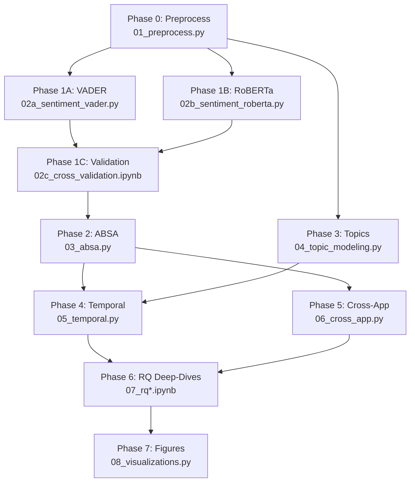

# Sentiment Analysis Plan — Salah App User Reviews

## Overview

**Dataset**: 732,194 Google Play reviews across 26 Salah/prayer apps, scraped August 2026  
**Purpose**: Multi-method sentiment and thematic analysis to support a research paper with 6 RQs spanning HCI, Islamic tech, gamification, gender inclusion, and hardware integration  
**Dual framing**: Findings will serve both as (a) a standalone analytical study of the Salah app ecosystem and (b) design implications for Falah

---

## Research Questions

| RQ | Title | Core Analysis Need |
|----|-------|-------------------|
| RQ1 | Gamification of Divine Obligation: Quantified Religion vs. Spiritual Anxiety | Aspect sentiment on trackers, streaks, goals; topic modeling for anxiety/pressure themes |
| RQ2 | Algorithmic Fidelity vs. Interface Usability in Spatial Worship | Aspect sentiment on prayer-time accuracy, calculation methods, qibla; usability themes |
| RQ3 | Dynamic Jurisprudence and the Friction of the Muslim Traveler | Aspect sentiment on madhab settings, qasr mode, travel; frustration theme detection |
| RQ4 | Bio-Spiritual Inclusion, Marginalized Design, and FemTech Privacy | Keyword extraction for women/menstruation/period tracking; privacy sentiment |
| RQ5 | Efficacy of Hardware-Augmented Worship and IoT Ecosystems | Aspect sentiment on widgets, companion hardware, smartwatch; compare hardware vs. non-hardware apps |
| RQ6 | Do Apps Deliver What They Preach? | Feature-promise vs. user-reality gap analysis; advertised features vs. review complaints |

---

## Phase 0 — Data Preprocessing

### 0.1 Merge & Normalize
- **Combine** all 26 per-app `reviews.csv` into a single master DataFrame with an `app_name` column
- **Deduplicate** by `reviewId`
- **Normalize text**: lowercase, strip URLs/emails/emojis (but preserve emoji for sentiment signal — store separately), fix encoding issues
- **Parse dates**: convert `at` column to proper `datetime`; extract `year`, `month`, `quarter`

### 0.2 Language Detection & Filtering
- Use `langdetect` or `fasttext` lid model to tag each review's language
- Create three analysis corpora:
  1. **English-only** (~primary corpus for sentiment models)
  2. **Non-English** (Arabic, Bengali, Urdu, etc.) — translate via `deep-translator` or `googletrans` → add to a **translated corpus**
  3. **Combined** (English + translated) — for volume/coverage analyses
- Report language distribution per app as a descriptive stat

### 0.3 Data Quality
- Drop reviews with empty `content` field
- Flag very short reviews (< 5 words) — keep them but mark for potential exclusion in sensitivity analyses
- Report basic stats: reviews per app, rating distribution, temporal coverage, review length distribution

> [!IMPORTANT]
> **Deliverable**: `scripts/01_preprocess.py` → outputs `data/master_reviews.parquet` + `data/corpus_english.parquet` + `data/corpus_translated.parquet`

---

## Phase 1 — Sentiment Classification (Multi-Method)

### 1.1 Method A: VADER (Lexicon-Based Baseline)
- Apply NLTK VADER to each review's `content`
- Output: `compound`, `pos`, `neg`, `neu` scores
- Classify: compound ≥ 0.05 → Positive; ≤ −0.05 → Negative; else → Neutral
- **Why**: Fast, interpretable, no GPU needed, strong baseline for short informal text

### 1.2 Method B: CardiffNLP RoBERTa (Transformer)
- Model: `cardiffnlp/twitter-roberta-base-sentiment-latest` (fine-tuned on ~124M tweets)
- Batch inference on GPU (5090) — should handle 732K reviews in ~30-60 min
- Output: 3-class probabilities (Negative / Neutral / Positive) + argmax label
- **Why**: State-of-the-art for social media text; captures sarcasm, implicit sentiment

### 1.3 Method C: Star-Rating Proxy (Weak Labels)
- Map: 1-2★ → Negative, 3★ → Neutral, 4-5★ → Positive
- Used as **weak ground truth** for model agreement analysis
- **Known limitation**: Star rating reflects overall app satisfaction, not per-aspect sentiment

### 1.4 Cross-Method Validation
- Compute Cohen's κ and accuracy between:
  - VADER vs. Star proxy
  - RoBERTa vs. Star proxy
  - VADER vs. RoBERTa
- **Hand-labeled gold set**: Randomly sample 500 reviews (stratified by app-tier and star rating), hand-label as {Positive, Negative, Neutral, Mixed}
  - Compute precision/recall/F1 for each method against gold set
  - Report inter-annotator agreement if multiple annotators (Krippendorff's α)
- Confusion matrices for all pairs

> [!TIP]
> **Recommendation on sampling for hand-labeling**: Stratify by app popularity tier (>100M, 10M-100M, 1M-10M, <1M installs) × star rating (1-2, 3, 4-5) to ensure coverage of edge cases.

> [!IMPORTANT]
> **Deliverables**:
> - `scripts/02a_sentiment_vader.py`
> - `scripts/02b_sentiment_roberta.py` (GPU-optimized with batched inference)
> - `notebooks/02c_cross_validation.ipynb` (agreement metrics, confusion matrices)
> - `data/master_reviews_with_sentiment.parquet`

---

## Phase 2 — Aspect-Based Sentiment Analysis (ABSA)

This is the most critical phase for your RQs — not just "is this review positive?" but "what feature is the user talking about and how do they feel about it?"

### 2.1 Define Aspect Taxonomy

Based on your CSV feature columns and the RQs, we define **14 aspect categories**:

| Aspect | Keywords / Patterns | Primary RQ |
|--------|-------------------|------------|
| **Prayer Times / Accuracy** | prayer time, salat time, wrong time, accurate, calculation, inaccurate, fajr, maghrib, isha | RQ2, RQ6 |
| **Adhan / Notifications** | azan, athan, adhan, alarm, notification, reminder, sound, ring, alert, silent | RQ2 |
| **Qibla** | qibla, compass, direction, kaaba, mecca, pointing, calibrat | RQ2 |
| **Calculation / Madhab** | hanafi, shafi, maliki, hanbali, madhab, method, isna, mwl, umm al-qura, calculation method | RQ3 |
| **Travel / Qasr** | travel, qasr, short prayer, journey, airport, abroad, moving, location change | RQ3 |
| **Tracker / Gamification** | track, streak, goal, score, miss, log, record, habit, progress, badge, challenge | RQ1 |
| **Women / Period** | women, sister, period, menstruation, haid, menses, cycle, exemption, exclude | RQ4 |
| **Privacy / Data** | privacy, data, permission, tracking, spyware, sell data, share data | RQ4 |
| **Ads / Monetization** | ad, ads, advertis, premium, subscribe, paid, free, in-app purchase, paywall | RQ6 |
| **UI/UX** | interface, design, ui, ux, easy, difficult, confusing, beautiful, clean, ugly, crash, bug, slow | RQ2, RQ6 |
| **Islamic Content** | quran, hadith, dua, dhikr, sura, ayah, tafsir, guide, learn | RQ6 |
| **Mosque / Community** | mosque, masjid, nearby, community, congregation, jamaat | RQ6 |
| **Hardware / Widget** | widget, watch, smartwatch, wearable, ring, hardware, companion | RQ5 |
| **Forbidden Times** | forbidden, makruh, sunrise, zawaal, sunset, haram time | RQ3 |

### 2.2 Extraction Method

**Approach**: Hybrid — keyword matching + zero-shot transformer classification

1. **Keyword-based aspect tagging**: For each review, check if any keyword from the taxonomy matches. A review can map to **multiple aspects**.
2. **Zero-shot classification** (for ambiguous reviews): Use `facebook/bart-large-mnli` as a zero-shot classifier with the aspect labels as candidates. This catches reviews that discuss an aspect without using exact keywords.
3. **Per-aspect sentiment**: Apply the RoBERTa sentiment model to the sentence(s) within a review that triggered each aspect (sentence-level splitting where possible). This gives us **aspect × sentiment** tuples.

### 2.3 Output
- Each review gets: `[{aspect: "prayer_times", sentiment: "negative", confidence: 0.92}, ...]`
- Aggregated: aspect × sentiment × app crosstab

> [!IMPORTANT]
> **Deliverables**:
> - `scripts/03_absa.py` (aspect tagging + per-aspect sentiment)
> - `data/aspect_sentiments.parquet`

---

## Phase 3 — Topic Modeling

### 3.1 BERTopic Discovery
- Use `BERTopic` with `all-MiniLM-L6-v2` embeddings
- Run on the English corpus (pre-cleaned: stopwords removed, lemmatized)
- Target: 30-50 automatically discovered topics
- Manually label/merge topics into coherent themes
- Reduce to ~15-20 interpretable topics

### 3.2 Map Topics to RQs
- Manually inspect top-20 representative documents per topic
- Tag each topic with relevant RQ(s)
- Compute topic prevalence per app

### 3.3 Sentiment per Topic
- For each topic cluster: compute average sentiment (from Phase 1)
- Produce **topic × sentiment** heatmaps

> [!TIP]
> BERTopic has built-in support for topic-over-time analysis — we'll leverage this in Phase 4.

> [!IMPORTANT]
> **Deliverables**:
> - `scripts/04_topic_modeling.py`
> - `notebooks/04_topic_exploration.ipynb` (interactive topic inspection)
> - `data/topics.parquet`

---

## Phase 4 — Temporal Analysis

### 4.1 Sentiment Over Time
- Aggregate sentiment scores by `month` or `quarter` per app
- Rolling average (3-month window) sentiment trend per app
- Detect **significant sentiment shifts** (e.g., after major updates, privacy controversies)
- Muslim Pro privacy scandal (2020) case study — sentiment before/after

### 4.2 Topic Over Time
- BERTopic's `topics_over_time` feature
- Track which themes grow/shrink over time (e.g., "ads" complaints increasing?)

### 4.3 Version-Based Analysis
- Where `appVersion` is available: plot sentiment by version
- Detect which updates improved/worsened user sentiment

> [!IMPORTANT]
> **Deliverables**:
> - `scripts/05_temporal.py`
> - `notebooks/05_temporal_visualizations.ipynb`

---

## Phase 5 — Cross-App Comparative Analysis

### 5.1 App-Level Aggregation
- Per app: mean sentiment, aspect coverage, dominant complaint themes, review volume
- Rank apps by overall sentiment (both VADER and RoBERTa)
- Rank apps by each aspect's sentiment (e.g., "best qibla experience")

### 5.2 Feature Coverage vs. Sentiment
- Merge with your CSV feature matrix (the ✓ columns)
- **Key question (RQ6)**: Do apps that claim to have a feature get better sentiment scores *for that aspect*?
- Compute correlation between feature-presence (binary from CSV) and aspect sentiment
- Chi-square tests: does having "Women tracking" correspond to significantly different sentiment in the "Women / Period" aspect?

### 5.3 Statistical Tests
- **Kruskal-Wallis H-test**: Compare sentiment distributions across app tiers (by downloads)
- **ANOVA / Welch's t-test**: Compare sentiment across apps for specific aspects
- **Effect sizes**: Cohen's d for pairwise app comparisons
- **Bonferroni correction** for multiple comparisons

### 5.4 Developer Response Analysis
- What fraction of reviews get developer replies? (per app)
- Does developer reply presence correlate with higher subsequent ratings?
- Sentiment of developer replies themselves
- Time-to-reply analysis

> [!IMPORTANT]
> **Deliverables**:
> - `scripts/06_cross_app.py`
> - `notebooks/06_cross_app_analysis.ipynb`
> - `data/app_comparison.csv`

---

## Phase 6 — RQ-Specific Deep Dives

### RQ1: Gamification & Spiritual Anxiety
- Filter to "Tracker / Gamification" aspect
- Sub-topic modeling within this aspect: streaks-anxiety vs. motivation vs. guilt
- Sentiment distribution for apps WITH trackers vs. WITHOUT
- Qualitative coding: sample 50 tracker-related negative reviews for thematic analysis

### RQ2: Algorithmic Fidelity vs. Usability
- Cross-tab: "Prayer Times / Accuracy" sentiment × calculation method support (from CSV)
- Qibla complaints taxonomy: compass calibration, GPS, wrong direction
- Usability complaints vs. accuracy complaints — which dominates?

### RQ3: Jurisprudence & Travel
- Volume of "Calculation / Madhab" mentions per app
- Sentiment when madhab is mentioned — is it frustration about wrong defaults or praise for flexibility?
- Travel/qasr: how many apps even get discussed in travel context?
- Forbidden times: mentioned at all? In which apps?

### RQ4: Women & Privacy
- Volume analysis: how many reviews mention women/period features across all 26 apps?
- Sentiment breakdown for women-related reviews
- Privacy concerns: absolute volume & sentiment trend over time
- Cross-reference: apps WITH "Women tracking" (✓ in CSV) — does presence reduce negative sentiment?

### RQ5: Hardware & IoT
- Filter to reviews mentioning widgets, watches, companion hardware
- Compare sentiment for iQIBLA Life (has Zikr Ring) vs. others
- Widget reliability complaints

### RQ6: Promise vs. Reality
- For each app × feature pair where the CSV says ✓ (feature present):
  - Count reviews mentioning that feature
  - Compute sentiment ratio
  - Flag features with > 40% negative sentiment as "broken promises"
- For features marked absent in CSV: do users request them? (demand analysis)

> [!IMPORTANT]
> **Deliverables**:
> - `notebooks/07_rq1_gamification.ipynb` through `notebooks/07_rq6_delivery.ipynb`
> - One notebook per RQ for focused analysis and paper-ready figures

---

## Phase 7 — Visualization & Paper Figures

### Planned Figures

| # | Figure | Type | Section |
|---|--------|------|---------|
| 1 | Overall sentiment distribution (VADER vs. RoBERTa) | Grouped bar | Methodology |
| 2 | Cross-method agreement heatmap | Confusion matrix | Methodology |
| 3 | Per-app sentiment violin plots | Violin / ridgeline | Results |
| 4 | Aspect × sentiment heatmap (all apps) | Heatmap | Results |
| 5 | Feature-sentiment matrix (apps × aspects) | Annotated heatmap | RQ6 |
| 6 | Temporal sentiment trends (top 5 apps) | Line chart | Results |
| 7 | BERTopic topic map | UMAP scatter | Results |
| 8 | Word clouds (positive / negative / per aspect) | Word cloud | Results |
| 9 | Developer response rate vs. sentiment | Scatter + trendline | Results |
| 10 | Tracker apps: sentiment distribution | Split violin | RQ1 |
| 11 | Women-feature mention volume & sentiment | Bar + sentiment overlay | RQ4 |
| 12 | Feature promise vs. reality gap chart | Dumbbell / dot plot | RQ6 |

### Style
- Use `matplotlib` + `seaborn` with a consistent paper-quality theme
- Color palette: accessible (colorblind-safe), consistent across all figures
- Export as both PNG (300 DPI) and PDF (vector) for LaTeX

> [!IMPORTANT]
> **Deliverables**:
> - `scripts/08_visualizations.py` (all figures, batch export)
> - `figures/` directory with PNGs and PDFs

---

## File Structure

```
falah-paper-codes/
├── Salah App Analysis - Sheet1.csv          # Original feature matrix
├── scrape_reviews.py                        # Already done ✓
├── reviews/                                 # Already scraped ✓ (732K reviews)
│
├── scripts/
│   ├── 01_preprocess.py                     # Merge, clean, language detect
│   ├── 02a_sentiment_vader.py               # VADER sentiment
│   ├── 02b_sentiment_roberta.py             # RoBERTa sentiment (GPU)
│   ├── 03_absa.py                           # Aspect-based sentiment
│   ├── 04_topic_modeling.py                 # BERTopic
│   ├── 05_temporal.py                       # Time-series analysis
│   ├── 06_cross_app.py                      # Cross-app stats
│   └── 08_visualizations.py                 # All paper figures
│
├── notebooks/
│   ├── 02c_cross_validation.ipynb           # Sentiment model comparison
│   ├── 04_topic_exploration.ipynb           # Interactive topic inspection
│   ├── 05_temporal_visualizations.ipynb     # Temporal plots
│   ├── 06_cross_app_analysis.ipynb          # Comparative analysis
│   ├── 07_rq1_gamification.ipynb            # RQ1 deep-dive
│   ├── 07_rq2_algorithmic_fidelity.ipynb    # RQ2 deep-dive
│   ├── 07_rq3_jurisprudence.ipynb           # RQ3 deep-dive
│   ├── 07_rq4_women_privacy.ipynb           # RQ4 deep-dive
│   ├── 07_rq5_hardware.ipynb                # RQ5 deep-dive
│   └── 07_rq6_delivery.ipynb                # RQ6 deep-dive
│
├── data/
│   ├── master_reviews.parquet               # Cleaned, merged dataset
│   ├── corpus_english.parquet               # English-only
│   ├── corpus_translated.parquet            # Translated non-English
│   ├── master_reviews_with_sentiment.parquet # + VADER & RoBERTa scores
│   ├── aspect_sentiments.parquet            # Aspect-level results
│   ├── topics.parquet                       # BERTopic results
│   ├── app_comparison.csv                   # Aggregated cross-app stats
│   └── gold_labels/
│       └── hand_labeled_500.csv             # Hand-labeled validation set
│
├── figures/                                 # All paper figures (PNG + PDF)
│
└── requirements.txt                         # All Python dependencies
```

---

## Dependencies

```
# Core
pandas
numpy
pyarrow           # parquet I/O

# NLP / Sentiment
nltk              # VADER
transformers      # RoBERTa, BART zero-shot
torch             # GPU backend
sentence-transformers  # embeddings for BERTopic
bertopic          # topic modeling

# Language
langdetect        # language detection
deep-translator   # translation

# Visualization
matplotlib
seaborn
wordcloud

# Stats
scipy             # statistical tests
scikit-learn       # metrics, clustering

# Utility
tqdm
jupyter
```

---

## Execution Order



---

## User Review Required

> [!IMPORTANT]
> **Sampling strategy**: With 732K reviews, all phases can run on full data given your 5090 GPU. However, BERTopic may need batched embedding computation. I recommend running VADER on full data (instant), RoBERTa on full data (batched, ~30 min on 5090), and BERTopic on English-only corpus. Does this sound right?

> [!IMPORTANT]
> **Hand-labeling**: For the 500-review gold set, will you do the labeling yourself, or should I prepare a labeling interface/spreadsheet? How many annotators?

> [!WARNING]
> **Translation quality**: Machine-translated reviews (Bengali/Arabic → English) may lose sentiment nuance. I recommend reporting translated-corpus results separately with a caveat, not mixing them into the primary English analysis. Agree?

## Open Questions

1. **Aspect taxonomy**: The 14 aspects I proposed above are derived from your CSV feature columns + RQs. Should I add/remove/merge any? For example, "Forbidden Times" might be too niche for its own category — merge with "Prayer Times"?

2. **Statistical significance threshold**: Standard α = 0.05 with Bonferroni correction? Or do you have a preferred approach?

3. **Paper venue**: Is this targeting a specific conference/journal (e.g., CHI, CSCW, MobileHCI, IMWUT)? This would shape the framing and figure style.

4. **Comparison framing**: For Falah — should the analysis conclude with a "design recommendations" section derived from the findings, or keep Falah out of this paper entirely?
